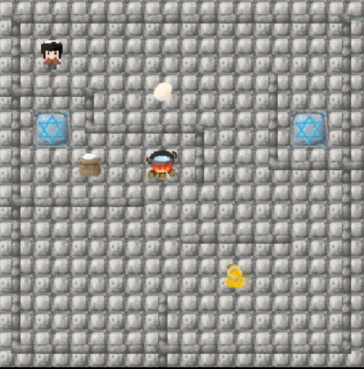

创意游戏设计

最初是想要设计一个做菜模拟器，可以制作犹太美食，但是又觉得直接将选原材料放入锅中，这个过程有些无聊，于是就想着将把它和传统的推箱子游戏结合，使得放入食材的过程也变得有趣。

相较于传统推箱子游戏，由于是制作菜肴的过程，因所有食材们的目标都是同一个锅，不同与传统推箱子每个箱子一个位置；其次，由于是制作菜肴，所以食材的投入顺序必须有要求，也即我们必须将食材按顺序放入锅中，也和传统推箱子不同；再者，为了增加游戏的可玩性，我们还添加了传送阵的设计。

游戏的规则

目标是将所有食材按顺序推入锅中，制成犹太美食

在地图上有以下元素

角色：可以控制上下左右移动

地板：角色可以在上面任意走

食材： 角色可以推，只有目标方向为地板，或者是锅，并且轮到该食材放入锅中，才可以推动

各种类型的墙：主人公无法走到上面，也无法将食材推上去

锅：角色可以经过，可以将食材按顺序推入，但是顺序不对时就无法推入而被卡住

传送阵：角色走到其上会立刻传送到地图上另一个传送阵位置，且食材无法传送

游戏的界面

​    

    
    

主菜单：可以选择跳转目标界面

帮助菜单：指明游戏目标，和需要注意的规则

关卡选择菜单：可以选择已经通过的关卡，未解锁的关卡按钮不同且无法选择

游戏界面：上下左右控制角色，下方提示

胜利结算界面：

游戏的关卡设计

